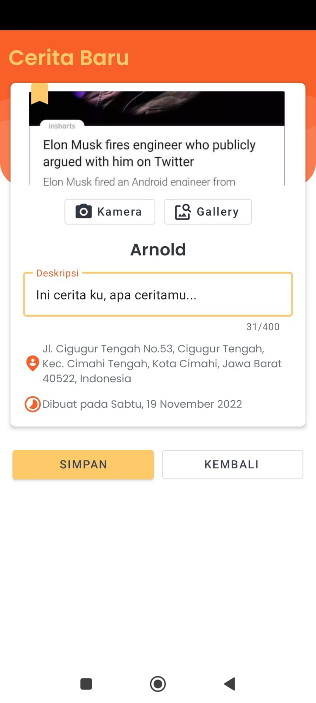

<h1 align="center">Student Story</h1> 

## Overview

<p>
Student Story is a small demo application based on modern Android application tech-stacks and MVVM architecture.<br>
Fetching data from the network and render data using Paging 3 and using geo location from Google Maps Api to displaying student stories.
<br><br>
This project has been completely from Dicoding Online Course at <b>Android Developer Learning Path.</b>
</p>

## Certificate of Competency

[Certificate of Competency](https://www.dicoding.com/certificates/0LZ0G93MNX65)

## Tech stack & Open-source libraries

- Minimum SDK level 23
- [Kotlin](https://kotlinlang.org/) based.
- [Coroutines](https://github.com/Kotlin/kotlinx.coroutines) for asynchronous and thread handling.
- Android Jetpack
    - Lifecycle - dispose of observing data when lifecycle state changes.
    - ViewModel - UI related data holder, lifecycle aware.
    - ViewBinding - write code that interacts with views.
    - Paging 3 - render list and pagination.
    - Room - database.
    - Android Preferences - android data preferences.
    - CameraX - take a picture.
    - Google Maps API - geo location.
- Architecture
    - MVVM Architecture (View - ViewModel - Model)
    - Repository pattern
- [Material-Components](https://github.com/material-components/material-components-android) - Material design components.
- [Retrofit2 & OkHttp3](https://github.com/square/retrofit) - construct the REST APIs and paging network data.
- [Gson](https://github.com/google/gson) - A modern JSON library for Kotlin and Java.
- [Timber](https://github.com/JakeWharton/timber) - logging.
- and more
  <br>

## Showcase

<p align="center">
    
    
    
    
    
</p>

# License

```xml 
Designed and developed by Indra Muliana (indra.ndra26@gmail.com) on November 2022

Licensed under the Apache License, Version 2.0 (the "License"); you may not use this file except in compliance with the License. You may obtain a copy of the License at

http://www.apache.org/licenses/LICENSE-2.0

Unless required by applicable law or agreed to in writing, software distributed under the License is distributed on an "AS IS" BASIS, WITHOUT WARRANTIES OR CONDITIONS OF ANY KIND, either express or
implied. See the License for the specific language governing permissions and limitations under the License.
```
